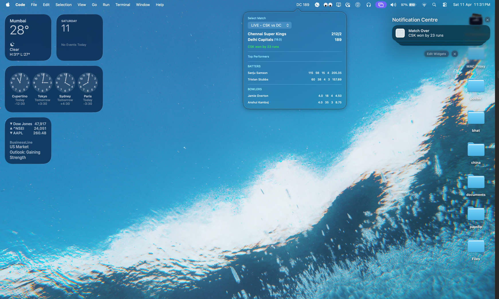

# Cricinfo

Built a real-time cricket tracker that combines a Playwright + Node.js + Redis ingestion API with a SwiftUI macOS menu bar app, delivering live scores and milestone notifications right on desktop.

     

- `cricinfo-api/`: Node.js + Express + Playwright backend for live match ingestion and APIs.
- `cricinfo-widget/`: macOS menu bar app (SwiftUI) that consumes the API.

## Preview



## Main Features

- Live score tracking in a macOS menu bar app.
- Match selection with persisted user preference.
- Automatic watcher warm-up from API when score cache is cold.
- Watchers auto-close when match is finished.

## Notifications

- Batter reaches 50.
- Batter reaches 100.
- Batter strike rate crosses above 200.
- Super over starts.
- 20+ runs scored in a completed over.
- Match over result.

## Project Structure

```text
.
├── cricinfo-api/
└── cricinfo-widget/
```

## Quick Start

### 1) Start API

```bash
cd cricinfo-api
npm install
npm start
```

### 2) Run Widget

Open the Xcode project:

- `cricinfo-widget/CricInfoWidget/CricInfoWidget.xcodeproj`

Set backend URL in widget code (if needed):

- `cricinfo-widget/CricInfoWidget/CricInfoWidget/APIService.swift`
