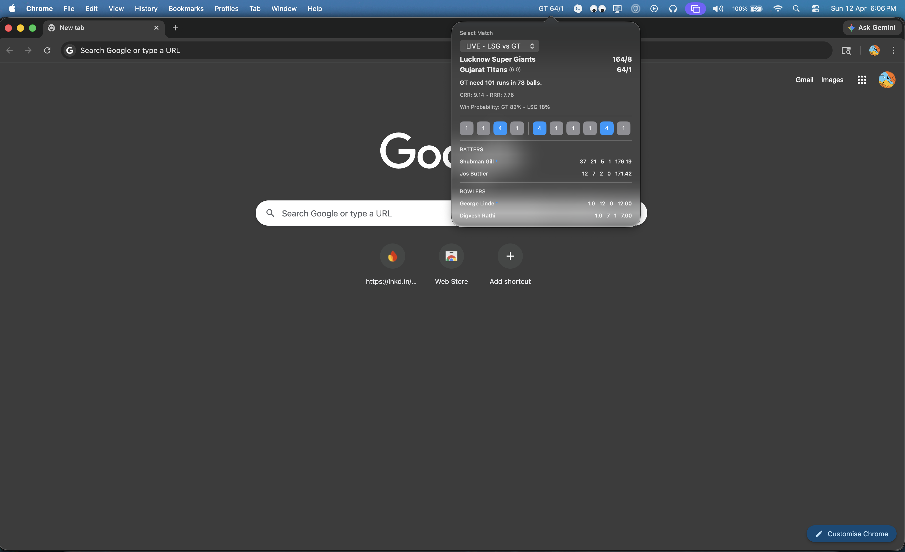

# Cricinfo Widget (macOS)

SwiftUI menu bar app for live cricket scores and notifications.

## Preview

## Project Path

- Xcode project: `CricInfoWidget/CricInfoWidget.xcodeproj`
- App source: `CricInfoWidget/CricInfoWidget/`

## Run

1. Open `CricInfoWidget/CricInfoWidget.xcodeproj` in Xcode.
2. Build and run scheme `CricInfoWidget`.

## Backend Dependency

The widget calls the API at:

- `http://127.0.0.1:3000`

Configure in:

- `CricInfoWidget/CricInfoWidget/APIService.swift`

## Notifications

The app sends local notifications for:

- Batter 50
- Batter 100
- Batter strike rate crossing above 200
- Super over start
- 10+ runs in completed over (test helper)
- Match over (result)
